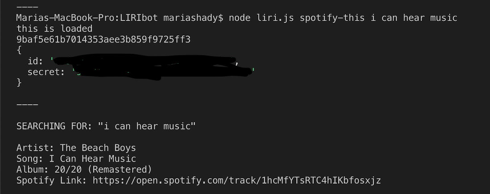
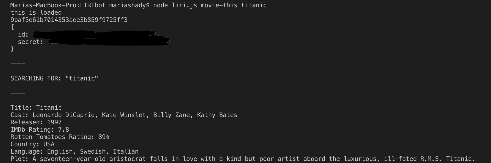

# LIRIbot
* For: UNH Portsmouth Coding Bootcamp
* Student: Maria Shady
* Built with: Nodejs, JavaScript
* API's: Spotify, OMDB 

## Description:
Liri is a command line application that takes user commands and queries from the command line and returns data from API's. 

## Functionality:

1. concert-this (Please see notes below)

2. spotify-this 

Function takes the userInput (command) and the userQuery(song), and returns the artist, full track name, a preview link and the album.

3. movie-this

Function takes the userInput (command) and the userQuery (movie), and returns title, cast, release date, ratings, country nof origin, original language and synopsis.

4. do-this (Please see notes below)

## Notes:

Please see issues noted in comment section of homework submission on bootcampspot.
